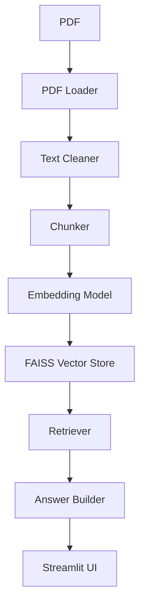

# Persian Academic Assistant 📚

An intelligent assistant for processing, understanding, and conducting Q&A on Persian academic papers and documents, built upon the RAG (Retrieval-Augmented Generation) architecture.

## ✨ Project Introduction

The **Persian Academic Assistant** is a powerful tool designed for researchers and students to solve the challenge of reading and extracting information from lengthy Persian academic papers.
This project is a RAG-based Persian academic assistant that:

* Receives Persian PDF files.
* Extracts the text.
* Normalizes and cleans the extracted text.
* Splits the text into semantic chunks.
* Generates vectors using Sentence Embedding.
* Stores the vectors in FAISS.
* Retrieves the most relevant sections using Semantic Search.
* Generates precise answers based on the retrieved context.

## 🚀 Features

* Persian PDF file support
* Text Cleaning with Hazm
* Sentence Based Chunking
* Multilingual Sentence Embedding
* Vector Database with FAISS
* Semantic Search
* Streamlit UI
* Ollama models support
* Modular architecture

## 🏗 Project Architecture



## 📂 Project Structure

```text
PersianAcademicAssistant/
├── .devcontainer/
├── modules/
│   ├── answer_builder.py
│   ├── chunker.py
│   ├── embedding.py
│   ├── pdf_loader.py
│   ├── retriever.py
│   ├── text_cleaner.py
│   └── vector_store.py
├── .gitignore
├── app.py
├── app_local_version.py
└── requirements.txt

```

## 🧠 Technologies Used

| Technology | Usage |
| --- | --- |
| **Python** | Main Language |
| **Streamlit** | UI |
| **PyMuPDF** | PDF Extraction |
| **Hazm** | Persian NLP |
| **Sentence Transformers** | Embedding |
| **FAISS** | Vector Store |
| **NumPy** | Vector Operations |

## ⚙️ Installation

To run this project on your local machine, follow these steps in order:

```bash
# 1. Clone the repository
git clone https://github.com/aminpy83/PersianAcademicAssistant.git

# 2. Navigate to the project directory
cd PersianAcademicAssistant

# 3. Create a virtual environment
python -m venv venv

# 4. Activate the virtual environment
# On Linux/macOS:
source venv/bin/activate
# On Windows:
venv\Scripts\activate

# 5. Install requirements
pip install -r requirements.txt

# 6. Run the application
streamlit run app_local_version.py

```

## 🌐 Online Demo

🔗 [https://persianacademicassistant.streamlit.app/](https://persianacademicassistant.streamlit.app/)

> **Note:** The online version is designed to showcase the project. Due to Streamlit environment limitations, it is not possible to use Ollama models on it.

## 🤖 Using Ollama

To use Ollama models, you must clone the project from GitHub and run it locally on your personal machine.

* **With a Dedicated GPU**: For faster processing and smoother answer generation, using an appropriate GPU is necessary.
* **Install Ollama**: First, install Ollama from its official website.
* **Download Model**: Download your preferred language model (e.g., `qwen` or `llama3`). Example: `ollama pull qwen:7b`
* **Run Localhost**: Run the Ollama server locally so the application can connect to the service.
